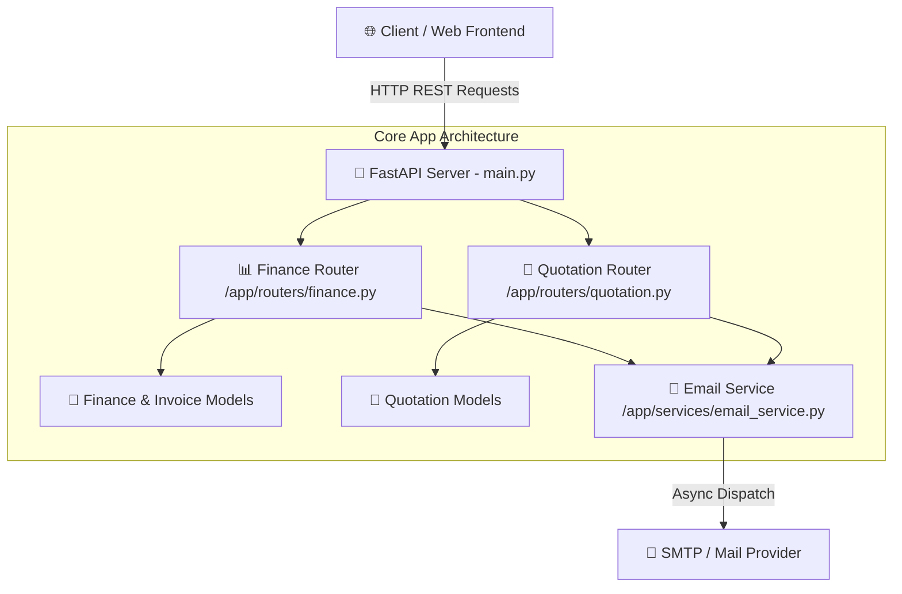

<div align="center">

  <h1>🤖 Autonomous AI Employee System</h1>
  <p><strong>An Intelligent Multi-Agent Workforce Platform for Financial Automation, Quotations, & Async Workflows</strong></p>

  <p>
    <a href="https://github.com/ShayanMuhammad-CS/AI_Employee/stargazers">
      
    </a>
    <a href="https://github.com/ShayanMuhammad-CS/AI_Employee/blob/main/LICENSE">
      
    </a>
    
    
    
  </p>

  <a href="#-features">✨ Features</a> •
  <a href="#-architecture">🏗️ Architecture</a> •
  <a href="#-quickstart">🚀 Quickstart</a> •
  <a href="#-api-endpoints">📡 API Endpoints</a> •
  <a href="#-contributing">🤝 Contributing</a>

</div>

<br/>

---

## 📌 Overview

The **Autonomous AI Employee System** is a next-generation backend architecture built with **FastAPI**, **Pydantic**, and **Async Web Services**. It acts as a digital agent workforce designed to automate core business operations: generating financial quotes, processing invoice models, executing email communications, and dispatching background tasks autonomously.

---

## ✨ Features

- 💼 **Automated Quotation Engine**: Fast calculation & generation of client quotes and service estimations.
- 💳 **Finance & Invoice Processing**: Robust models handling financial ledger operations and invoice tracking.
- ✉️ **Integrated Email Dispatch**: Asynchronous email delivery service for automated customer notifications.
- ⚡ **High-Performance FastAPI**: Asynchronous REST endpoints with automatic OpenAPI interactive documentation (`/docs`).
- 🎨 **Modern Frontend Integration**: Web dashboard interface for monitoring AI agent activity and quotation approvals.
- 🧪 **Comprehensive Test Suite**: Automated unit and integration testing via `pytest`.

---

## 🏗️ System Architecture



---

## 🚀 Quickstart

### 1. Prerequisites
- Python 3.10 or higher
- Git

### 2. Installation & Setup

```bash
# Clone the repository
git clone https://github.com/ShayanMuhammad-CS/AI_Employee.git
cd AI_Employee

# Create virtual environment
python -m venv venv

# Activate environment
# Windows:
venv\Scripts\activate
# Linux/macOS:
source venv/bin/activate

# Install dependencies
pip install -r requirements.txt
```

### 3. Environment Configuration

Create a `.env` file in the root folder:
```env
APP_NAME="AI Employee System"
DEBUG=True
PORT=8000
EMAIL_HOST=smtp.gmail.com
EMAIL_PORT=587
EMAIL_USERNAME=your_email@gmail.com
EMAIL_PASSWORD=your_app_password
```

### 4. Running the Application

```bash
# Start dev server with auto-reload
uvicorn main:app --reload --port 8000
```
Open **`http://localhost:8000/docs`** in your browser to test endpoints visually!

---

## 🧪 Running Tests

```bash
# Run backend pytest test suite
pytest

### Frontend

# From the frontend folder (Node.js required)
cd frontend
# Install deps
npm install
# Run unit tests
npm run test
# Run e2e tests (Playwright)
npm run test:e2e
```

---

## 🤝 Contributing

Contributions, issues, and feature requests are welcome!
1. Fork the Project
2. Create your Feature Branch (`git checkout -b feature/NewAgentFeature`)
3. Commit your Changes (`git commit -m 'Add NewAgentFeature'`)
4. Push to the Branch (`git push origin feature/NewAgentFeature`)
5. Open a Pull Request

---

<div align="center">
  Developed with ❤️ by <a href="https://github.com/ShayanMuhammad-CS"><strong>Shayan Muhammad</strong></a>
</div>
